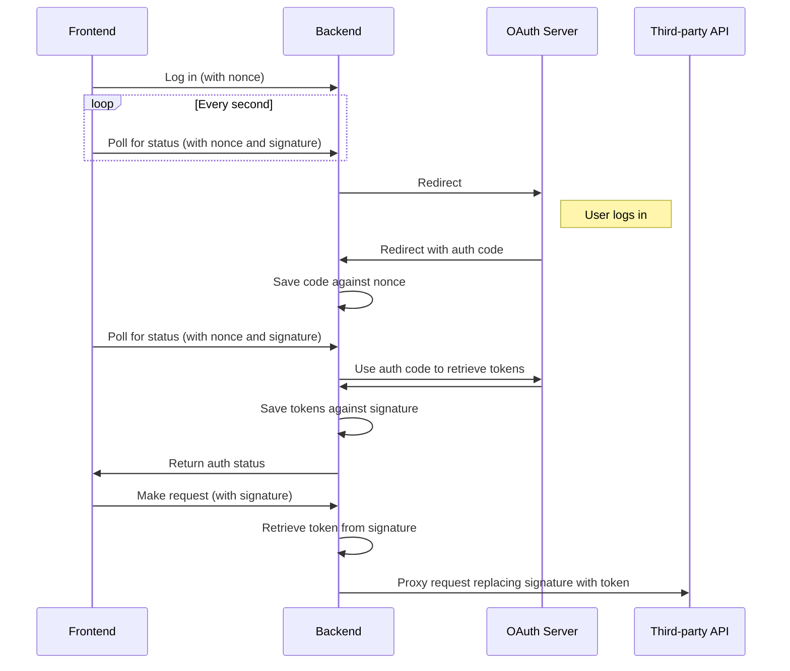

# Making authenticated requests

Implementing any non-trivial functionality in an app requires that the app
interact with services external to it. However, it's often not enough for the
app to drive that interaction. Rather, we need our apps to make requests of
other services on behalf of the user that is using the app. To modify data
stored in their Stripe account, for example, or export information to documents
stored in their Google Drive account.

Making requests on behalf of a user requires those requests to be securely
authenticated. Authentication for requests originating from Stripe Apps is based
on secure signatures that can be verified using an app secret but the
implementation will be different depending on what you want to do. In this guide
we will go over all the common cases so you can make sure your implementation is
secure.

## Requests to Stripe APIs from the frontend

Requests to Stripe APIs made from an app frontend using the Stripe SDK are
automatically authenticated for the user of your app. You don't need to pass in
the account or user ids of the user making the request in code such as this:

```js
useEffect(() => {
  stripeClient.customers.list().then((response) => setCustomers(response.data));
}, []);
```

You are limited, however, to making requests that the user has granted you
[permissions](https://stripe.com/docs/security/permissions) for.

## Requests to a Stripe Apps backend

If you
[build a custom backend](https://stripe.com/docs/stripe-apps/build-backend) for
your app you usually need a way for the server to verify which Stripe user made
a specific request. For example, you wouldn't want someone to be able to
retrieve personal information belonging to a different user.

To fulfill this purpose, the Stripe Apps SDK provides a function that generates
a secure signature based on the current user and account. You can then send that
signature to the server where it can be verified using a shared server-side
secret. This is what it looks like on the frontend:

```ts
const fetchWithSignature = async (userContext, endpoint, requestInit) => {
  // By default the signature is signed with user id and account id.
  const signaturePayload = {
    user_id: userContext.id,
    account_id: userContext.account.id,
  };
  return fetch(`https://example.com/${endpoint}/`, {
    ...requestInit,
    headers: {
      ...(requestInit.headers ?? {}),
      "stripe-signature": await fetchStripeSignature(),
      "stripe-user": JSON.stringify(signaturePayload),
    },
  });
};
```

And the backend:

```ts
app.get('/foo', (request, response) => {
  const sig = request.headers['stripe-signature'];
  // Retrieve user id and account id from the request body
  const payload = request.headers['stripe-user'];
  try {
    // Verify the payload and signature from the request with the app secret.
    stripe.webhooks.signature.verifyHeader(payload, sig, appSecret);
  } catch (error) {
    response.status(400).send(error.message);
  }
  const { user_id, account_id } = JSON.parse(payload);
  // Process the request using the user_id and account_id to validate
  // user permissions
  response.json(<response>);
});
```

The above is a generic solution but for extra security you may add additional
parameters to the signature. This prevents someone who has intercepted the
signature from making unauthorized requests.

```ts
const securePostRequest = async (userContext, endpoint, requestData) => {
  // By default the signature is signed with user id and account id.
  const signaturePayload = {
    user_id: userContext.id,
    account_id: userContext.account.id,
  };
  return fetch(`https://example.com/${endpoint}/`, {
    method: "POST",
    headers: {
      "Stripe-Signature": await fetchStripeSignature(requestData),
      "Content-Type": "application/json",
    },
    // Include the account ID and user ID in the body to verify on backend.
    body: JSON.stringify({
      ...requestData,
      ...signaturePayload,
    }),
  });
};
```

And the backend:

```ts
app.post('/foo', (request, response) => {
  const sig = request.headers['stripe-signature'];
  // Retrieve user id and account id from the request body
  const payload = request.body;
  try {
    // Verify the payload and signature from the request with the app secret.
    stripe.webhooks.signature.verifyHeader(payload, sig, appSecret);
  } catch (error) {
    response.status(400).send(error.message);
  }
  const { user_id, account_id, ...requestParams } = JSON.parse(payload);
  // Process the request using the user_id and account_id to validate
  // user permissions and the requestParams to execute the request
  response.json(<response>);
});
```

TODO: All of this will probably need to be reworked once Stripe moves away from
JSON.stringify as a hashing mechanism

## Requests to Stripe APIs from the backend

Operations using the Stripe SDK in the frontend are automatically made on behalf
of the logged-in account. When you use the Stripe SDK on the backend, however,
it will default to using the account whose API key you passed in when
initializing the client, which should be the developer account associated with
the app.

However, that account still has permissions to make requests on behalf of any
account that has installed the app. This can be triggered by passing a
`stripeAccount` parameter to the options of any SDK operation:

```ts
app.post("/foo", async (request, response) => {
  const sig = request.headers["stripe-signature"];
  // Retrieve user id and account id from the request body
  const payload = request.body;
  try {
    // Verify the payload and signature from the request with the app secret.
    stripe.webhooks.signature.verifyHeader(payload, sig, appSecret);
  } catch (error) {
    response.status(400).send(error.message);
  }
  const { account_id, name } = JSON.parse(payload);
  // Use the verified account_id to make a request on behalf of that account

  const customer = await stripe.customers.create(
    {
      name,
      description: "Test Customer (created for API docs)",
    },
    {
      stripeAccount: account_id,
    }
  );

  response.json(customer);
});
```

Always make sure you verify the id you pass to `stripeAccount` with a signature,
whether from an app request or a webhook. You don't want to make requests on an
account unless you're sure that account is the one that initiated the process.

## Requests to third-party OAuth APIs

You will often need to make requests of a non-Stripe API that has its own
authentication mechanism. Usually, this will be an OAuth API where the user will
have to log onto the APIs system and give permissions for your app to access it.
Then, your app will have to save and use an authorization code specific to that
user for all requests to the API.

If your OAuth server supports authenticating with
[PKCE](https://oauth.net/2/pkce/) you can authenticate directly from the
frontend by using `createOAuthState` to create a code verifier and challenge and
using `https://dashboard.stripe.com/${environment}/apps-oauth/${appId}` as a
redirect URI back to your app. The OAuth redirect parameters will be available
in the `oauthContext` prop passed to your default view. You can use those
properties to fetch the user's tokens from the OAuth server and use them to make
requests to the third-party API. Note that both the OAuth endpoints and the
third-party API endpoints will have to be added to the
[app's permitted URLs](https://stripe.com/docs/stripe-apps/extend-dashboard-user-interface#use-third-party-apis)
by using `stripe apps grant url`. More details about this process can be found
in the [guide](TODO: pkce docs here) and
[example](https://github.com/stripe/stripe-apps/tree/master/examples/dropbox-oauth-pkce).

If your OAuth server does not support cross-origin PKCE authentication, you will
need to set up a backend that receives the OAuth redirect and can then be
accessed by our frontend to either fetch the authorization code or make requests
to the third-party API by proxying through our backend, which takes on the job
of translating signature-validated user and account ids into the stored codes.
The process is explained in the diagram below.



This is all rather complex so we won't walk through an implementation here but there is a
[detailed code sample](https://github.com/stripe/stripe-apps/tree/master/examples/basic-auth)
in the official Apps examples.

Whether you can use the PKCE path or not, because of sandboxing, you cannot store OAuth tokens client-side in cookies or as JSON web tokens as you might in other apps the authenticate with OAuth. Instead, you can use the [Stripe Secret Store API](https://stripe.com/docs/stripe-apps/store-auth-data-custom-objects). This allows you to securely store secrets like OAuth tokens with Stripe and retrieve them in the app when necessary. These secrets won't be lost across changes in the current page, or upon user sign out from Stripe.

Secrets in the secret store are associated with a specific user, for a specific app, within a specific Stripe account. Each app can store up to 10 different types of secrets in the store, such as OAuth tokens, refresh tokens, and other secrets that may be required.