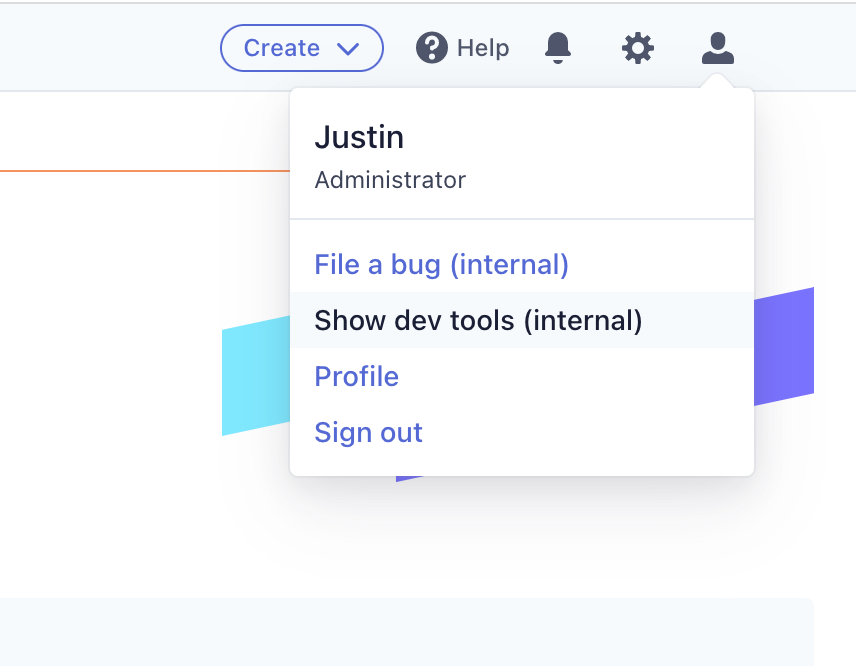
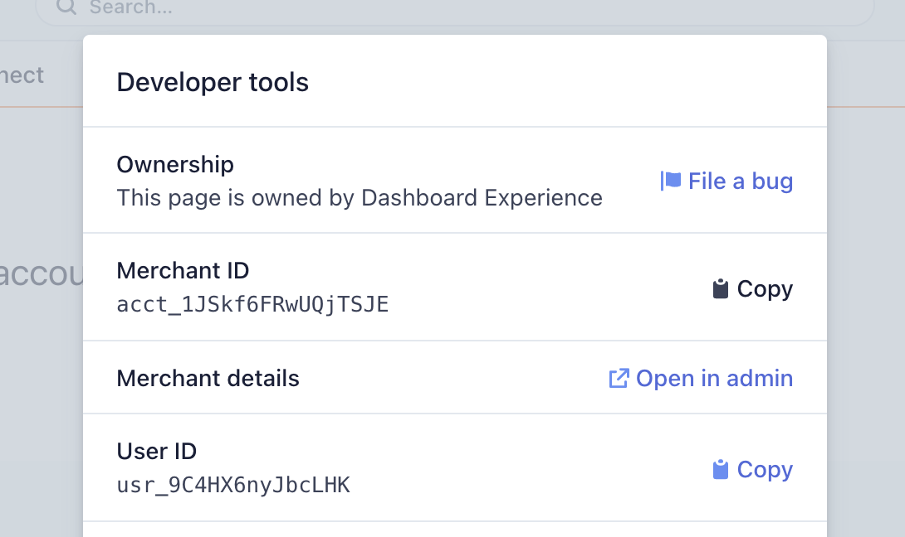

## Gating yourself in as a Stripe

1. Go [https://amp.corp.stripe.com/feature-flags/flag/tailor_ui_extensions](https://amp.corp.stripe.com/feature-flags/flag/tailor_ui_extensions)
1. Add your `merchant id` to the list
1. Get a member of the `Tailor App Platform team` to approve

### How do I find my merchant id?
1. Go to https://dashboard.stripe.com/
1. Use the developer tools to find your `merchant id`

