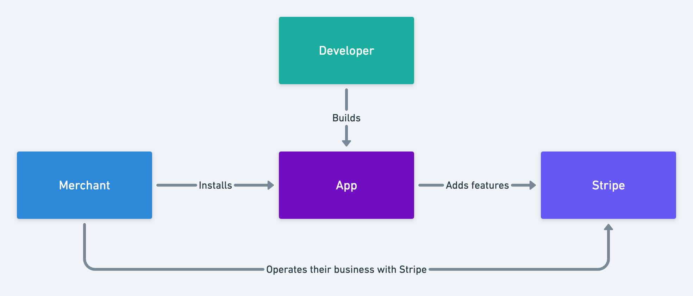

# Apps overview

## What is a Stripe App?
Stripe Apps extend the functionality of Stripe. Most apps are built by 3rd party developers in our ecosystem, but we also use Stripe Apps internally to bring you new features for Stripe.

As a developer you can build apps that add new features to Stripe by adding UI Modules to Stripe Dashboard, store data with Stripe, make Stripe API requests on behalf of users, or integrate with 3rd party services. You are free to mix and match the capabilities of the Stripe platform to build new experiences for Stripe.

Our Merchants are using Stripe Apps to tailor Stripe to their needs, operate their business more efficiently, integrate Stripe with external services and add new features to their specific Stripe account.

## Concepts and terminology

Stripe Apps leverages the capabilities of the Stripe Platform, and on a high-level enables you to:

Connect with the Stripe API to make operations and listen to events on behalf of users who have installed your app
Use the Stripe API to store your own data objects together with Stripe objects.
Extend the UI of the Stripe Dashboard to enable your own UI-driven workflows and visualizations of data.

Apps are the package of capabilities used to build a new experience for Stripe. Apps are declaratively defined via our app manifest format, and are packaged along with any supporting materials as a single artifact for consumption by Stripe.

See action on how the Stripe App Manifest works.

The capabilities provided by Stripe is:

1. **Dashboard UI extensions** enable developers to create custom UI for the Stripe Dashboard. These can be used to augment existing Stripe workflows as well as create entirely new features hosted within the Dashboard that take advantage of the UI toolkit, teams, permissions, security, and hosting already built into the Dashboard. See more in https://github.com/stripe/tailor-preview/tree/master/docs/ui-extensions 

1. **Custom Data** enables developers to use the Stripe platform to store their own data in their own namespace within Stripe and associate data with Stripe objects, so it's easily discoverable and mappable.

1. **App Backend** enable developers to act on behalf of a Stripe user by making Stripe API calls and listening to webhook events from Stripe

## Getting started

See [Create an App](/create)
