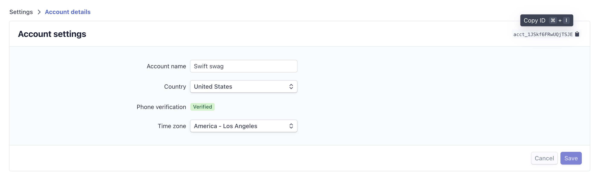

# Create an App

In this doc, you'll use Stripe CLI to create an app, generate the boilerplate code for building your app, and automate many common development tasks.

## Scenario

You want to build an App, that is using the `UI extension` capability to extend the Stripe Dashboard. Since this is your first time creating a Stripe app, you want to start with boilerplate code that makes your programming experience easier and more efficient.
You can look through some example apps to get a better idea of the different things that are possible.

You can look through some [example apps](../../examples) to get a better idea of the different things that are possible.

## Step 1: Get your account into the preview

1. Go to [Stripe's account settings page in the Dashboard](https://dashboard.stripe.com/settings/account)
1. Copy your account ID from the top right corner of the Account settings panel.

1. Send your account ID to your Stripe contact and ask them to enable Tailor Apps on your account.

## Step 2: Get the forked Stripe CLI 
1. Get the latest build of the Stripe CLI from https://github.com/stripe/tailor-preview/releases/latest.
1. Download it to a convenient location.
1. Move the file to your `/Users/<username>/stripe` folder to avoid getting a warning from Santa.
1. If you are getting an untrusted warning from MacOS due to the lack of signing, run the `xattr -r -d com.apple.quarantine /Users/<username>/stripe/stripe-preview` and it will remove the flag. See [more for details](https://apple.stackexchange.com/questions/337268/how-can-i-remove-the-downloaded-from-the-internet-security-from-all-files-in-a).
1. Setup an alias for the preview CLI so you can access it globally.
```sh
alias stripe-preview=/Users/<user>/stripe/stripe-preview
```

## Step 3: Bootstrap your app
```sh
$ stripe-preview tailor create [name]
```

This will create a new, minimal tailor.json file.

## Step 4: Now time to use some capabilities

Your basic app has now been bootstrapped, but it does not do much yet. Next for you is to use some of the platform capabilities to add functionality.  

We recommend you to continue with UI extensions for Dashboard.

[Learn more about building apps with UI extensions for Dashboard](../ui-extensions/README.md)


