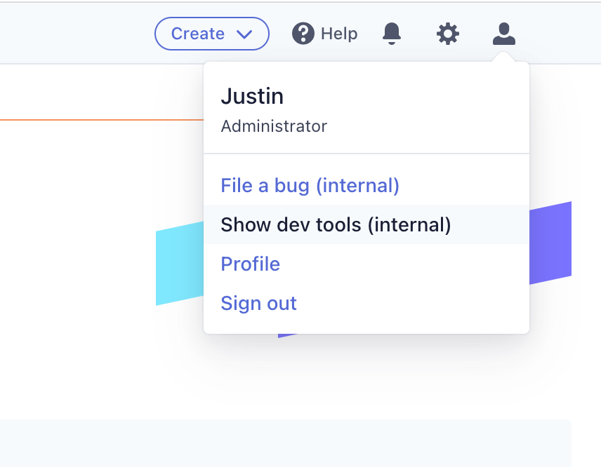
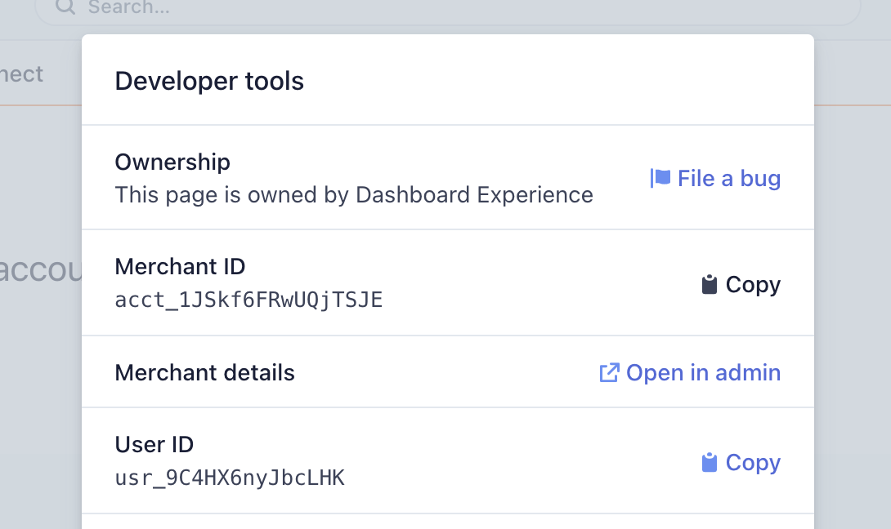

# Create an App

In this doc, you'll use Stripe CLI to create an app and generate the boilerplate code for building your app and automates many common development tasks.

## Scenario

You want to build an App, that is using the `UI extension` capability to extend the Stripe Dashboard. Since this is your first time creating a Stripe app, you want to start with boilerplate code that makes your programming experience easier and more efficient.

You can look through some [example apps](../../examples) to get a better idea of the different things that are possible.

## Step 1: Flag yourself into Tailor (Stripes)

1. Go to https://dashboard.stripe.com/
1. Use the developer tools to find your `merchant id`




1. Go [https://amp.corp.stripe.com/feature-flags/flag/tailor_ui_extensions](https://amp.corp.stripe.com/feature-flags/flag/tailor_ui_extensions)
1. Add your `merchant id` to the list
1. Get a member of the `Tailor App Platform team` to approve

## Step 2: Get the forked Stripe CLI 
1. Get a build of the [Stripe CLI from the tailor-preview repository](../../cli)
1. Download it to a convenient location.
1. Move the file to your `/Users/<username>/stripe` folder to avoid getting a warning from Santa.
1. If you are getting an untrusted warning from MacOS due to the lack of signing, run the `xattr -r -d com.apple.quarantine /Users/<username>/stripe/stripe-preview` and it will remove the flag. See [more for details](https://apple.stackexchange.com/questions/337268/how-can-i-remove-the-downloaded-from-the-internet-security-from-all-files-in-a).
1. Setup an alias for the preview CLI so you can access it globally.
```sh
alias stripe-preview=/Users/<user>/stripe/stripe-preview
```

## Step 3: Bootstrap your app
```sh
$ stripe-preview tailor create [name]
```

This will create a new, minimal tailor.json file.

## Step 4: Now time to use some capabilities

Your basic app has now been bootstrapped, but it does not do much yet. Next for you is to use some of the platform capabilities to add functionality.  

We recommend you to continue with UI extensions for Dashboard.

[Learn more about building apps with UI extensions for Dashboard](../ui-extensions/README.md)


