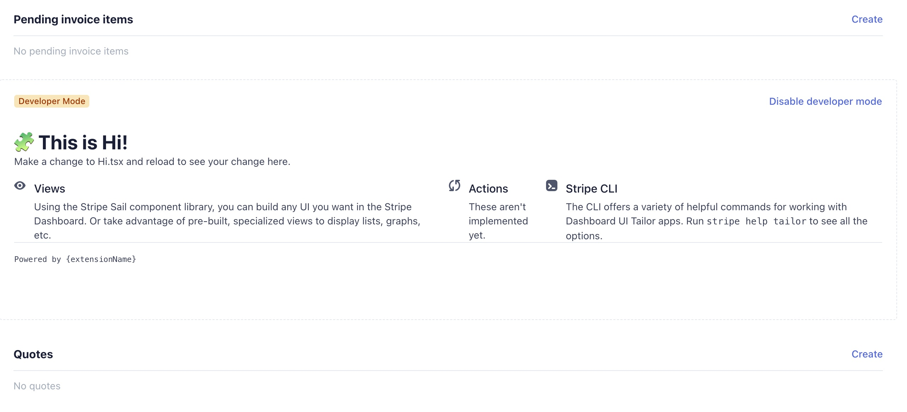
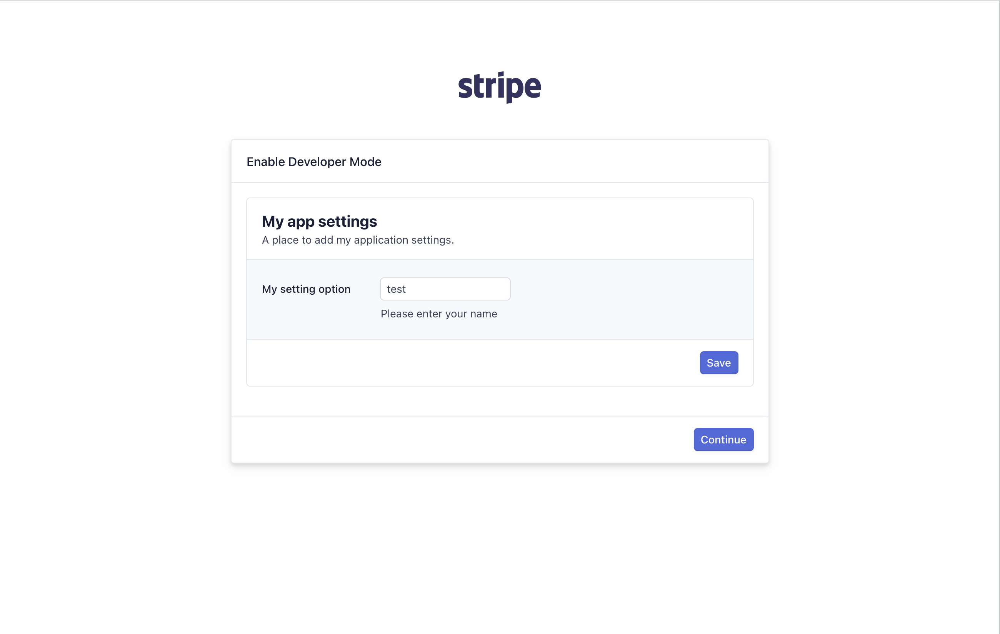

# UI extensions for Dashboard 

UI extensions for Dashboard enable developers to create custom UI for the Stripe Dashboard. These can be used to augment existing Stripe workflows as well as create entirely new features hosted within the Dashboard that take advantage of the UI toolkit, teams, permissions, security, and hosting already built into the Dashboard.

**Note:** While UI extensions are in private preview, you'll need to be added to the Stripe NPM organization in order to have access to the SDK. Send your npm username to the Stripe team to have them add you.

## How it all works
- Using the Stripe CLI, developers can set up a new extension, configure their extension, and generate boilerplate for fulfilling Stripe’s interfaces
- Developers write TypeScript React components (called "Views") the Stripe Dashboard will render
    - There are a number of "viewports" exposed in the Dashboard where extension developers can insert their functionality.
    - Developers have access to a React UI component kit provided by Stripe that they can compose new components out of
    - Since the extension code is running in a iframe created by the Dashboard, all interfaces are promise based and make heavy use of [`async`/`await`](https://developer.mozilla.org/en-US/docs/Learn/JavaScript/Asynchronous/Async_await)
- Developers test their changes in the live Stripe Dashboard by running a development server locally with the Stripe CLI
- Once the extension is ready for others to use, developers use the Stripe CLI to build the extension and push it to Stripe for publication.

## Getting started
### Step 1: Generate a view
If you haven't already created an app, see [Creating a new app](../create/README.md). Once you have setup your basic app, you can use the Stripe CLI to generate your first view that extends a part of the Dashboard.

```sh
$ stripe-preview tailor generate view
```

Follow the wizard in the CLI. The most important question you'll need to answer is where your view will appear in the Dashboard. Currently we only support `EmbedView`s, or UI extension views that are embedded on a Stripe object detail page.

<dl>
  <dt>`stripe.dashboard.customer.main`</dt>
  <dd>View will appear on the customer page</dd>

  <dt>`stripe.dashboard.invoice.main`</dt>
  <dd>View will appear on the invoice page</dd>

  <dt>`stripe.dashboard.product.main`</dt>
  <dd>View will appear on the product page</dd>
</dl>

Once all that is done it's time for you to serve up the apps locally from your machine.

### Step 2: Serve your app from your local machine
```sh
$ stripe-preview tailor serve 
```

This command open the Stripe Dashboard and prompt to enable developer mode. Once you are in developer mode the Dashboard will load your extension from your local machine.

### Step 3: See your app in action
Go to the Stripe Dashboard and navigate to where the view is configured to appear (for example, [a product page](https://dashboard.stripe.com/products))

The "Hello world" extension will appear right above the Metadata section.

Modify the view that was generated above and observe that changes are reflected in the Dashboard

## Extension SDK API reference
The “extension SDK” is the set of interfaces that Stripe supports for injecting new functionality into the Stripe Dashboard. The two ways of doing this are using Actions (coming soon!) and Views.

### Views
```sh
$ stripe-preview tailor generate view # Follow the prompts that appear
```
Every "view" that a UI extension exports must return one of the Stripe-provided base views below.

Views are React components (with some limits). These views are permitted to have `children` and are how entirely custom UI experiences can be built. 

- The first child of a View must be a Stripe-provided view container (ie `EmbedView`)
- The UI Components available are based on Stripe's internal design system, Sail
- Views can be instantiated in Modals (or perhaps Drawers, TBD)
  - Eventually developers will be able to make entire custom Dashboard pages that appear in the Dashboard navigation. Please let us know if this is critical to your use case.

#### Props
Views are passed props that the extension can use for context on where the extension is being displayed.

| Field  | Description | Properties |
|--------|-------------|------------|
| `user` | The current signed in user | `id` |
| `account` | The current signed in account | `id` |
| `object` | Optional. In `ObjectView`s this is the current object that is being viewed in the Dashboard. `object` is the type associated with the `id` | `id`, `object` |

### `EmbedView`
Embedded views appear on Stripe object detail pages like [`/customers/cus_1234`](https://dashboard.stripe.com/test/customers/cus_1234) or [`/invoices/in_1234`](https://dashboard.stripe.com/test/invoices/in_1234).

For now they always appear above the Metadata section. On the customer page, the view will appear between pending invoice items and quotes.



#### Props
| Field         | Type     | Description                                                                                                        | Required |
|---------------|----------|--------------------------------------------------------------------------------------------------------------------|----------|
| `title`       | `string` | The title of the view. This is displayed to users and should orient the user to what the intention of the view is. | Yes      |
| `description` | `string` | A longer form description of what the view does. This will be displayed under the title.                           | No       |

#### Example
```tsx
import {
  BodyExtra,
  EmbedView,
} from '@stripe-internal/extensions-sail';

const HappyView = () => (
  <EmbedView title="Simple stuff" description="This section communicates my extension's feelings">
    <BodyExtra>Happy</BodyExtra>
  </EmbedView>
)
```

### [Coming soon!]  `FocusView`
These are opened from other Views and allow the developer to open a dedicated space for the end user to do a specific task. Examples include:
- Enter in details to create a new entry in a database
- Go through a wizard to decide on next steps
- Confirm that the user wants to take the action they indicated

#### Props
| Field     | Type                                                 | Description                                                                                                                                                                                                                                                                                                                                                                                      | Required           |
|-----------|------------------------------------------------------|--------------------------------------------------------------------------------------------------------------------------------------------------------------------------------------------------------------------------------------------------------------------------------------------------------------------------------------------------------------------------------------------------|--------------------|
| `title`   | `string`                                             | The title of the view. This is displayed to users and should orient the user to what the intention of the view is.                                                                                                                                                                                                                                                                               | Yes                |
| `shown`   | `boolean`                                            | Whether the view should be shown or not. This is the property that would be maintained by another view (like the `EmbedView`) to decide when to enter the focused state.                                                                                                                                                                                                                         | Yes                |
| `actions` | `React.Element<typeof Button \| typeof ButtonGroup>` | Either a single [`Button`](https://stripe.dev/tailor-preview/super-secret-private-ui-docs/?path=/docs/components-actions-navigation-button--basic) or a [`ButtonGroup`](https://stripe.dev/tailor-preview/super-secret-private-ui-docs/?path=/docs/components-actions-navigation-buttongroup--basic) that contains buttons to place in the footer of the view. IE a "Save" or "Continue" button. | Yes (due to a bug) |
| `width`   | `'small' \| 'medium' \| 'large' \| 'xlarge'`         | The width of the view. Defaults to `medium`                                                                                                                                                                                                                                                                                                                                                      | No                 |
| `onClose` | `() => void`                                         | If the user clicks out of the `FocusView` or presses the escape button, this will be called to inform the extension that the user has closed the view.                                                                                                                                                                                                                                           | No                 |

#### Example
```tsx
import {useState} from 'react';
import {
  Button,
  BodyExtra,
  EmbedView,
  FocusView,
  Select,
  SelectOption,
} from '@stripe-internal/extensions-sail';

type Mood = 'Happy' | 'Sad';

const MoodView = () => {
  const [mood, setMood] = useState<Mood>('Happy');
  const [picker, setPicker] = useState<boolean>(false)
  const updateMood = (newMood) => {
    setMood(newMood);
    setPicker(false);
  };
  return (
    <EmbedView title="Mood picker" description="This section communicates my extension's feelings">
      <FocusView
        shown={picker}
        onClose={setPicker(false)}
        actions={
          <Button label="Cancel" onClick={() => setPicker(false)} />
        }
      >
        <Select onChange={updateMood}>
          <SelectOption label="Happy" value="Happy" />
          <SelectOption label="Sad" value="Sad" />
        </Select>
      </FocusView>
      <BodyExtra>Happy</BodyExtra>
      <Button label="Change mood" onClick={() => setPicker(true)} />
    </EmbedView>
  );
}
```

### `SettingsView`
Settings views appear in Settings and allow end-users to configure specific details about how the app should work with their specific account. For instance, a Zendesk app would need a `SettingsView` to collect what Zendesk instance the app should communicate with from the administrator.

The SettingsView is a bit different from the other views in that it is not tied to a specific object. The Settings view will have predefined locations in which it will be available. For now, the SettingsView appears when we enable Developer Mode for our application but it will have more locations in the future. 

To define a SettingsView, you must add a view with the `settings` viewport to your app manifest. An application with a settings view would have an app manifest with a `ui_extension` field that would look something like this:
```json
{
  ...,
  "ui_extension": {
    "views": [
      ...,
      {
        "viewport": "settings",
        "component": "AppSettings"
      }
    ],
  }
}
```

#### Props

| Field | Type | Description | Required |
| ----- | ----- | ----- | ----- | 
| `header` | `string` | A string to display as the settings header | No |
| `subheader` | `string` | A string to display as the subheader | No |
| `onSave` | `(values: {[key: string]: any}) => void` | A callback function to run when a user hits the save button | Yes |
| `statusMessage` | `string` | A string to communicate a status message to the user - useful for displaying errors and success messages | No |

#### Example

An example using provided components for styling forms. 

```tsx
import {useState, useCallback} from 'react';
import {
  FormLayout,
  FormBlock,
  FormRow,
  FormField,
  TextInput,
  SettingsView,
} from '@stripe/tailor-browser-sdk/ui';

type FormStatus = 'initial' | 'saving' | 'saved' | 'error';

const AppSettings = () => {
  const [status, setStatus] = useState<FormStatus>('initial');

  const saveSettings = useCallback(async (values) => {
    setStatus('saving');
    try {
      const result = await fetch(
        'https://www.my-api.com/',
        {
          method: 'POST',
          body: JSON.stringify(values)
        }
      );
      await result.text();
      setStatus('saved');
    } catch (err) {
      console.error(error);
      setStatus('error');
    }
  }, []);

  const getStatusLabel = useCallback(() => {
    switch(status) {
      case 'saving':
        return 'Saving...';
      case 'saved':
        return 'Saved!';
      case 'error':
        return 'Error: There was an error saving your settings.';
      case 'initial':
      default:
        return '';
    }
  }, [status]) 
  const statusLabel = getStatusLabel();

  return (
   <SettingsView 
    header="My app settings" 
    subheader="A place to add my application settings."
    statusMessage={statusLabel}
    onSave={saveSettings}
  >
      <FormLayout title="Set a greeting">
        <FormBlock>
          <FormRow name="username" label="My setting option">
            <FormField
              label="Name"
              description="Please enter your name"
            >
              <TextInput
                name="username"
                id="username"
              />
            </FormField>
          </FormRow>
        </FormBlock>
      </FormLayout>
    </SettingsView>
  );
}
export default AppSettings;

```

The above example renders in the UI as follows:


### [Coming soon!] Actions

Actions appear as buttons/links or in context menus for Stripe objects that they’re attached to. For example, you could attach an action to an order object that would add “Cancel shipment in Shippo” everywhere the order is shown in the Dashboard. When that button or menu item is clicked, the extension’s JS function is called.


#### Create stub file
In order to have an action, the developer needs to register their action in app.json, specify which object types it supports, and write a JS or TS function that fulfills the interface. The Stripe CLI helps with all of this.
```sh
    $ stripe-preview tailor generate action # Follow the prompts that appear
```

#### Interface
```ts

    type Action = {
      label: string | (context: Context) => string,
      disabled: (context: Context) => Boolean,
      onClick: (context: Context, trigger: Trigger) => Promise<void>
    }
```
| Field      | Explanation                                                                                                                                                |
| ---------- | ---------------------------------------------------------------------------------------------------------------------------------------------------------- |
| `label`    | What gets displayed in the button or menu when this action is displayed.                                                                                   |
| `disabled` | Whether or not this action should be disabled in the current context                                                                                       |
| `onClick`  | The meat of the action. This gets called when a user actually clicks on the button or menu option. See “Triggers” below for more details on that argument. |

#### Triggers
Trigger objects allow the developer to manipulate the button or menu item as the action is doing work.

| Field     | Type                                               | Explanation                                                                                                                                                                                                            |
| --------- | -------------------------------------------------- | ---------------------------------------------------------------------------------------------------------------------------------------------------------------------------------------------------------------------- |
| `loading` | `(label: string) => void`                          | Transitions the button or menu item to a “loading” state. This disables the element and displays the appropriate spinner.                                                                                              |
| `error`   | `(message: string) => void`                        | Transitions the button or menu item to an “error” state. This disables the element and puts the error message into the UI as appropriate (usually a toast)                                                             |
| `success` | `(message?: string) => void`                       | Resets the element back to an interactive state and displays the success message as appropriate (usually in a toast). If the action returns without calling any transition, `success` is called with a `null` message. |
| `state`   | `"idle"\|"loading"\|"error"` | Allows the developer to inspect the current state of the trigger.                                                                                                                                                      |


#### Examples
```typescript
    // This action reflects its state in the button or menu item that triggered it
    export create_case = {
      label: "Trigger 'Flag for CEO' in Zapier",
      disabled: (context: Context): Boolean => !context.object.metadata.has_been_flagged,
      callback: async (context: Context, trigger: Trigger): Promise<void> => {
        trigger.loading("Flagging...");
        const response = await fetch("http://zapier/flag_this_object_to_jefe");
        if (response.status <= 300) {
          trigger.error(`Failed to flag: ${await response.body().message}`);
        }
        trigger.success(`Flagged ${context.object.name} for CEO to review`);
      }  
    };
```
```typescript


    // This action is stateless - it just kicks off a view that moves the workflow forward
    import {instantiateModalView} = '@stripe/extension-sdk';
    
    export reply_to_case = {
      label: "Reply to Zendesk case",
      callback: async (context: Context, trigger: Trigger): Promise<void> => {
        instantiateModalView("ZendeskReplyForm", {
          zendesk_case_id: context.object.id,
        });
      },
    };
```

### Calling HTTP APIs

#### Calling Stripe
**Calls made to the Stripe API will be made as the _user_ and tagged with the app making the call.** If the user does not have permission to make the call requested, the call will throw a `StripePermissionError`.

Extensions can make calls to the Stripe API with the standard [Stripe JS API client](https://github.com/stripe/stripe-node).

##### Example
```typescript
import {createHttpClient} from '@stripe/tailor-browser-sdk/http_client';
import Stripe from 'stripe';

const stripe = Stripe(process.env.STRIPE_API_KEY, {
  httpClient: createHttpClient(),
})

// Now that the client is initialized, we can use it to call the API.
const makeNewCustomer = async () => {
  // If the user has permission to create customers, this should succeed.
  const newCustomer = await stripe.customers.create({
    email: 'customer@example.com',
  });
  console.log(newCustomer.id);
};
```

#### Calling a 3rd party API
To call out to a 3rd party API, developers can use [fetch](https://developer.mozilla.org/en-US/docs/Web/API/Fetch_API), as seen in the code example below. Before a fetch call will succeed, the developer must explicitly allow the UI extension to call the desired URL. Developers can do this by adding this URL to `connect-src` array in the `content_security_policy` configuration in the [App Manifest](https://stripe.dev/tailor-preview/super-secret-private-ui-docs/?path=/docs/getting-started-app-manifest--page). You can read more about Content Security Policy [here](https://developer.mozilla.org/en-US/docs/Web/HTTP/CSP).


**A URL added to `connect-src` must:**
1. use secure https protocal
2. not be not stripe-owned 
3. contain a path
4. only contain a wildcard (*) in the left-most DNS label

Some examples of valid URLs include: 
- https://www.example.com/api/users -> contains secure protocol and a path
- https://*.example.com/api/users/ -> contains a wildcard in the left-most DNS label

Some examples of invalid URLS include:
- http://www.example.com/ ->  does not contain secure protocol and is missing a path
- https://api.stripe.com/v1/charges/ -< this is a stripe-owned API
- https://www.*.example.com/api/users/ -> wildcard is not in the left-most DNS label


Follow these steps to enable your UI extension to hit your 3rd party API:
1. Add the URL you wish to call to the [tailor.json file](../tailor.json.md#CSPRequest)
2. Start or restart your development server. — `$ stripe-preview tailor serve`
3. Now you can use `fetch` in order to call the URL you configured in step 1.
4. If the API in question has a JS client library that may work as well if it supports running in a browser context. Simply add the dependency to your extension using `npm add`

```typescript
const makeRequestToService = (endpoint, method, requestData) => {
  return fetch(`https://example.com/${endpoint}/`, {
    method,
    headers: {
      'Content-Type': 'application/json',
    },
    body: requestData,
  });
};
```

#### [Coming soon!] Calling your own servers
To call servers that you have control of, you additionally can ensure that the caller is your Stripe Dashboard UI Extension by adding a provided signed secret to the request.

1. Follow the [steps for calling out to any third party](#calling-a-3rd-party-api)
1. Add the `Stripe-Signature` header with a signature provided by the `useStripeSignature` SDK function
```typescript
import {useStripeSignature} from '@stripe/tailor-browser-sdk/request_signing';

const makeRequestToMyBackend = (endpoint, method, requestData) => {
  return fetch(`https://mywellknownbackend.com/${endpoint}/`, {
    method,
    headers: {
      // User needs to call `useStripeSignature` every time, they can't just
      // save the signature to a variable as it will be refreshed from time to time
      'Stripe-Signature': useStripeSignature(),
      'Content-Type': 'application/json',
    },
    body: requestData,
  });
};
```
1. Decode the signature on your server in order to ensure that it is a request from your UI Extension
```typescript
// TODO: Show how to use the stripe clients to decode this signature
```
