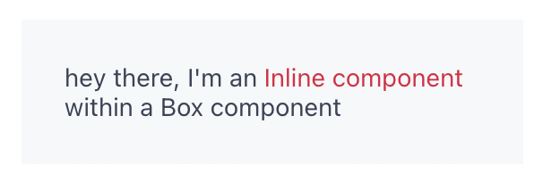
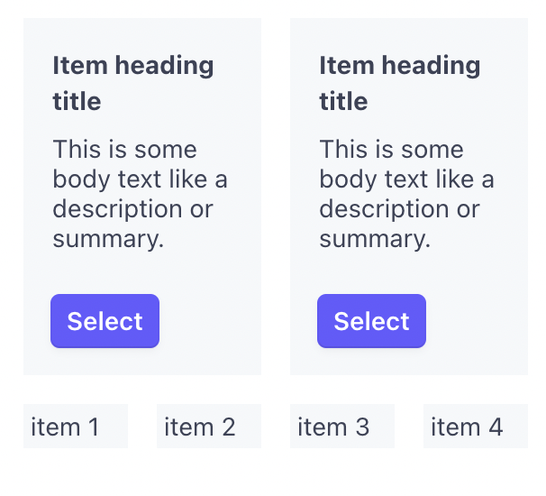

# Using the Stripe UI toolkit

## UI toolkit philosophy

The idea around the Stripe UI toolkit is to make UI development easy and fast without spending too much time on planning the overall look and feel of your app. By limiting the options available, we ensure that custom Stripe apps are uniform in design and feel while allowing you to focus more on creating your functional app, and less trying to decide on how to make it look.

Since apps are embedded in the Stripe dashboard, it's important that apps keep their design close to the branding of Stripe, but also give enough flexibility to express your own style and brand.

While the Stripe components are limited in nature and by design, we still give you some room to add your own flair to your UI design. Keeping our components restricted by nature is important for security purposes, however these restrictions aren't final.

Since the Stripe UI toolkit is in Beta, please let us know if you have any feedback or suggestions on the state of restrictions with our components so we can get a better idea of how to make our components better.

If you'd like to get a better idea for how the UI toolkit works, check out the examples apps in the [Stripe apps examples](https://github.com/stripe/stripe-apps/tree/master/examples) folder.

If you'd like to see how each component looks, check out [Stripe's Figma](https://stripe.com/docs/stripe-apps/ui-toolkit/figma).

To learn more about the development limitations with the UI toolkit, read our [UI toolkit limitations](https://stripe.com/docs/stripe-apps/ui-toolkit/limitations) guide.

## Understanding the styling system

The bulk of styling layouts lies within the `css` property of `Inline` and `Box` components. The `css` property is an object that accepts camelCase properties native to CSS. This CSS property accepts all the most popular CSS properties and thanks to Typescript, it's easy to see which properties are available.

As it was explained in the UI toolkit philosophy section, you can only use the values we have defined rather than custom values. This is so we can keep a uniform look between apps that reflects Stripe's brand while giving you some flexibility to express your own brand.

Here is an example of how `Box` is used to style individual elements within your components. This example is pulled from the ["Messaging" example](https://github.com/stripe/stripe-apps/blob/master/examples/messaging/src/views/Messaging.tsx).

```jsx
<ListItem
  id={message.id}
  key={message.id}
  title={
    <>
      <Box>{message.subject}</Box>
      <Box css={{ font: "caption", color: "secondary" }}>
        {getEpochMsDisplayText(message.date)}
      </Box>
    </>
  }
/>
```

Here, `Box` is used to apply styling to our `message.subject`. Like `Box`, `Inline` could also be used because they serve the same function, but in a slightly different way.

The differences between `Box` and `Inline` are subtle, but important to understand. `Inline` is used when you want to, for example, apply styling to a particular piece of text within a sentence; to highlight or point out a piece of text. `Box` is used when you want to apply styling to the entire sentence rather than a particular piece.

You can read more about [Inline](https://stripe.com/docs/stripe-apps/ui-toolkit/components/inline) and [Box](https://stripe.com/docs/stripe-apps/ui-toolkit/components/box) in the [UI toolkit documentation](https://stripe.com/docs/stripe-apps/ui-toolkit/components).

### Using Box and Inline components

As a brief example of how `Inline` and `Box` are used, refer to the image below.



The code for the example looks like:

```jsx
<Box
  css={{
    backgroundColor: "container",
    padding: "large",
  }}
>
  hey there, I'm an{" "}
  <Inline
    css={{
      color: "critical",
    }}
  >
    Inline component
  </Inline>{" "}
  within a Box component
</Box>
```

With these two components, we can start applying styles to other UI components.

## Common layout patterns

### Grid

The concept of a grid layout is a little bit different than the way you might be familiar with. It's built by combining rows and columns using the `Box` component with specific CSS attributes set.

Building a grid system in your Stripe app begins with specifying a `Box` component with a CSS property of `layout: column`. Beginning with a single wrapping column component allows us to specify a gap property which makes building multi-dimensional grids easier.

```jsx
<Box
  css={{
    layout: "column",
    gap: "medium",
    marginY: "large",
  }}
>
  {/* rows */}
</Box>
```

Once we have our column, now we need to specify our rows:

```jsx
{
  /* row */
}
<Box
  css={{
    layout: "row",
    gap: "medium",
  }}
>
  {/* row item */}
  <Box
    css={{
      width: "1/2",
      backgroundColor: "container",
      padding: "medium",
    }}
  >
    <Box
      css={{
        font: "body",
        fontWeight: "bold",
        marginBottom: "small",
      }}
    >
      Item heading title
    </Box>
    <Box css={{ marginBottom: "large" }}>
      This is some body text like a description or summary.
    </Box>

    <Button type="primary">Select</Button>
  </Box>
  {/* row item */}
  <Box
    css={{
      width: "1/2",
      backgroundColor: "container",
      padding: "medium",
    }}
  >
    <Box
      css={{
        font: "body",
        fontWeight: "bold",
        marginBottom: "small",
      }}
    >
      Item heading title
    </Box>
    <Box css={{ marginBottom: "large" }}>
      This is some body text like a description or summary.
    </Box>

    <Button type="primary">Select</Button>
  </Box>
</Box>;
```

We create each row by using the same method as our columns, by specifying a `layout: row` property within the `css` property itself. We are able to, once again, use a gap property to apply even styling to each row-item.

Within our rows, that's where we can start adding our content. Below is a visual representation of the code above.



### Forms

Stripe's UI toolkit provides many helpful components for building forms. Each component can be controlled.

```jsx
<Box
  css={{
    marginTop: "large",
    backgroundColor: "container",
    layout: "column",
    gap: "medium",
    padding: "medium",
  }}
>
  {/* https://stripe.com/docs/stripe-apps/ui-toolkit/components/textfield */}
  <TextField
    label="Email"
    placeholder="user@example.com"
    size="large"
    onChange={(e) => {
      console.log(e.target.value);
    }}
  />
  <TextField
    label="Name"
    placeholder="John Smith"
    onChange={(e) => {
      console.log(e.target.value);
    }}
    size="large"
  />
  {/* https://stripe.com/docs/stripe-apps/ui-toolkit/components/textarea */}
  <TextArea
    label="Biography"
    placeholder="Who are you?"
    onChange={(e) => {
      console.log(e.target.value);
    }}
  />
  {/* https://stripe.com/docs/stripe-apps/ui-toolkit/components/select */}
  <Select
    name="pet-select"
    label="Choose a pet"
    onChange={(e) => {
      console.log(e);
    }}
  >
    <option value="">Choose an option</option>
    <option value="dogs">Dogs</option>
    <option value="cats">Cats</option>
  </Select>
  <Button type="primary">Submit</Button>
</Box>
```

A visual representation:


