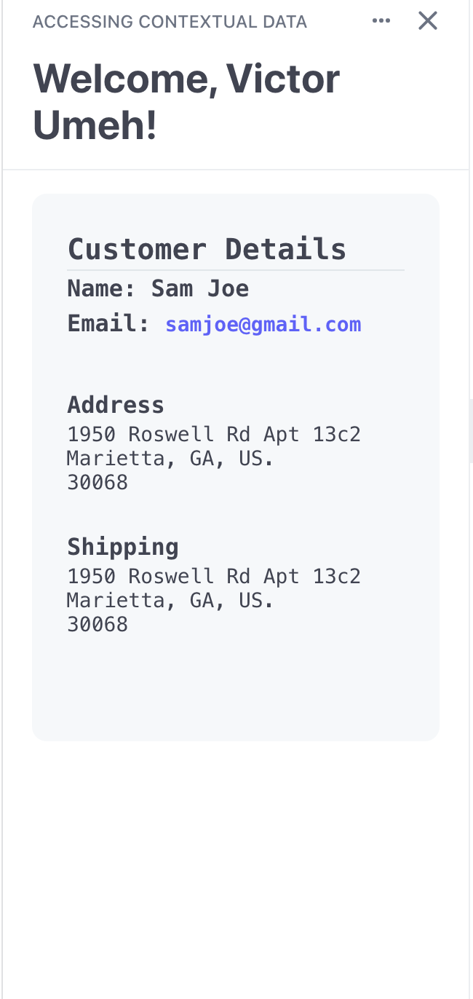

# Accessing Contextual Data Example


This is an example code that demonstrates accessing userContext and environment variables, accessing more data via Stripe API and outputing data into app view on each dashboard page.

## Features Demonstrated

- ExtensionContextValue
- Stripe API

## Running

1. From the `stripe-apps/examples/accessing-contextual-data` directory, run `yarn` to install dependencies.
2. Once you install the `stripe apps` CLI plugin, run the start command:

```
 stripe apps start
```