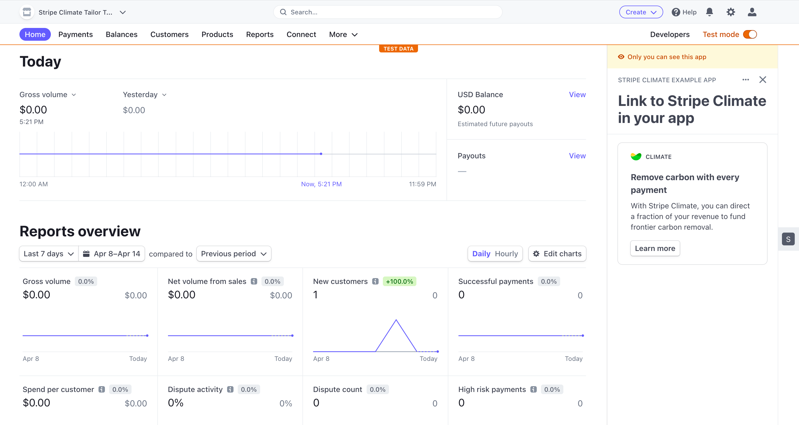

# Stripe Climate Example App



Simple example to show you how to integrate a link to Stripe Climate into your app.

## Setup

Make sure you are set up correctly by following the [UI Extension docs](https://stripe.com/docs/stripe-apps).

## Running

1. From the `stripe-apps/examples/climate` directory, run `yarn` to install dependencies
2. Once you install the `stripe apps` CLI plugin, run the start command:

```
stripe apps start
```

Then in your Stripe dashboard navigate to any page and you should see the example Stripe Climate
link snippet

## Using in your own app
To integrate within your app, follow these steps:

- Copy the files in /src/components (ClimateLinkComponent.tsx, etc.) into your own app.
- Add a reference to <ClimateLinkComponent /> in your UI as follows:
```
    <ClimateLinkComponent appId="<YOUR APP ID HERE>" />
```

That’s it!  Your app now links to Stripe Climate!

## Guidelines

Please do not use language that references ‘offsets’ as it pertains to Stripe Climate.  

- Traditional carbon offsets, while often inexpensive, are unlikely to scale to the size of the climate problem. 
- Instead, at Stripe Climate, we’ve chosen to focus on [permanent carbon removal technologies](https://stripe.com/blog/negative-emissions-commitment). 
- In the best case, we hope that these projects can grow to provide a material portion of the gigatons of carbon removal the world needs to limit a rise in temperature below agreed-upon targets.
- We select carbon removal projects based on criteria we developed in partnership with our scientific expert advisors, and we rely on our [public application and review process](https://github.com/stripe/carbon-removal-source-materials) instead of verifying through traditional carbon offset verifiers.

Have questions on Stripe Climate? Reach out to us at support+climate@stripe.com