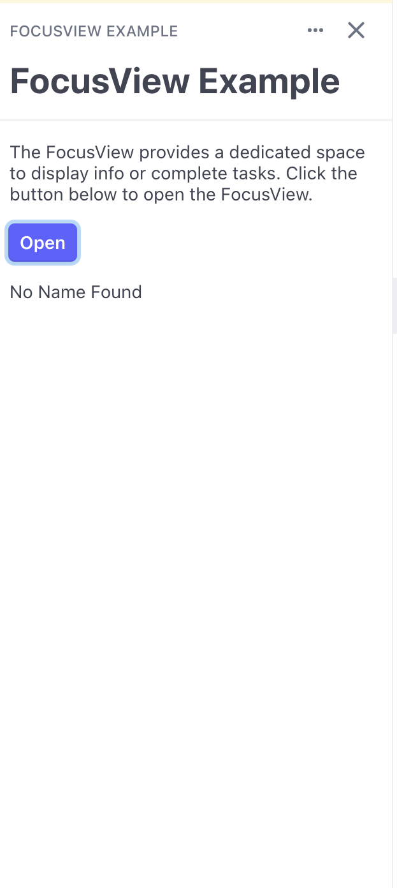
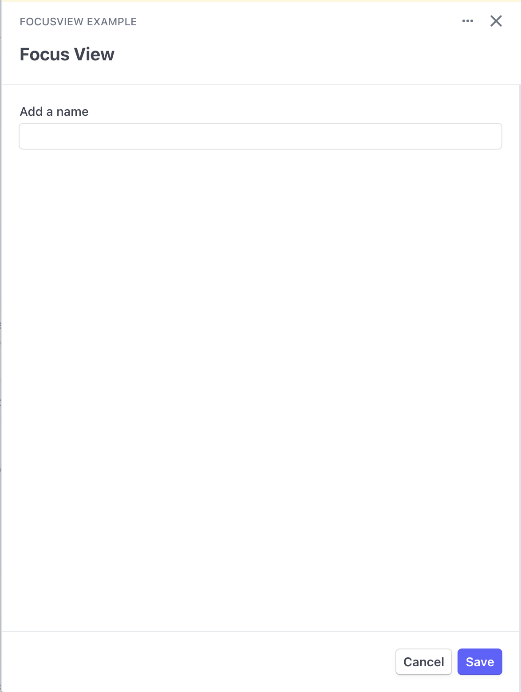

# Focus View Example




## Summarry

This is an example code that demonstrates opening and closing a FocusView.

## Running

1. From the `stripe-apps/examples/focus-view` directory, run `yarn` to install dependencies.
2. Once you install the `stripe apps` CLI plugin, run the start command:

```
 stripe apps start
```
