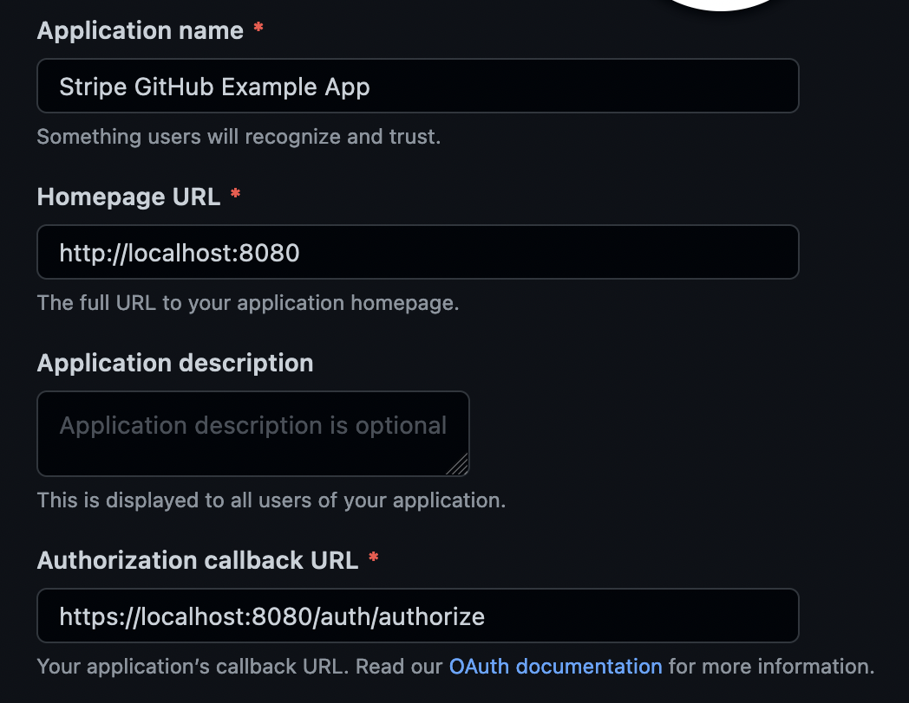

# [Demo] Authenticate with Github using OAuth

An example application that uses a custom back end server to authenticate the user with Github using OAuth.

Before you run this application, ensure you are set up by following the [UI Extension docs](https://stripe.com/docs/stripe-apps).

This example uses [yarn workspaces](https://classic.yarnpkg.com/lang/en/docs/workspaces/) with [concurrently](https://www.npmjs.com/package/concurrently) to start the front end application and the back end server concurrently.

Before starting the app, you will need to:

- Add the `stripe-preview` executable to your `/usr/bin` folder if you're on MacOS. This allows Stripe Apps to be launched from within a `package.json` script.
- Create a `.env` file inside the `/backend` folder with your Github Client Id and Client Secret variables. The included `.env.example` file can be used as a template.
- Run `yarn generateKeys` inside the `/backend` folder to generate a certificate for running the local back end server over HTTPS.
- [Create a new OAuth app within your Github account](https://docs.github.com/en/developers/apps/building-oauth-apps/creating-an-oauth-app). 



To run the application, run the following commands from the root folder:

```zsh
# install and hoist dependencies
yarn
```

```zsh
# start the front end and back end app concurrently
yarn start
```

The back end server will start on `localhost:8080`.

To start either the front end or the back end individually, you can use the following commands respectively:

```zsh
yarn run start:frontend
yarn run start:backend
```


