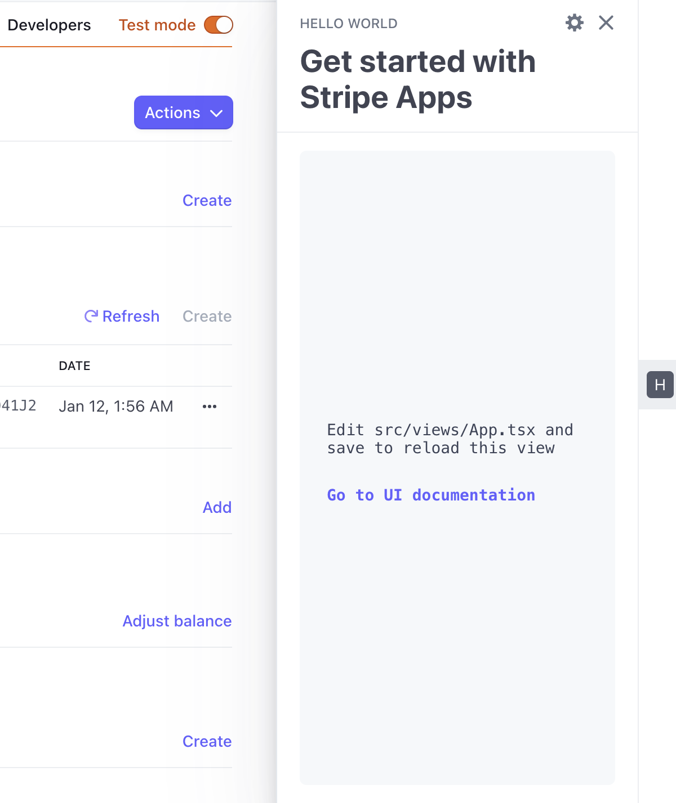

# Hello World Example App



Simple Hello World example. This is the same boilerplate code that's generated when you create a new Stripe App via `stripe apps create`.

## Setup

Make sure you are set up correctly by following the [UI Extension docs](https://stripe.com/docs/stripe-apps).

## Running

1. From the `stripe-apps/examples/helloworld` directory, run `yarn` to install dependencies
2. Once you have the `stripe-preview` CLI fork available locally, run the start command:

```
stripe-preview apps start
```

Then in your Stripe dashboard navigate to any Customer and open up the app drawer on the right. You'll then see the boilerplate "hello world" app.
