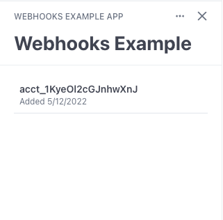

# Webhooks Example

The following example demonstrates an app that does some automated onboarding of
accounts when they install an app and then makes that information available to
the frontend. This will be a useful pattern in cases where you need to provision
resources for each connected account or even just track app installations.

## Running

This example consists of both a frontend and a backend component. Follow the
instructions in the READMEs of their respective folders to run it.
