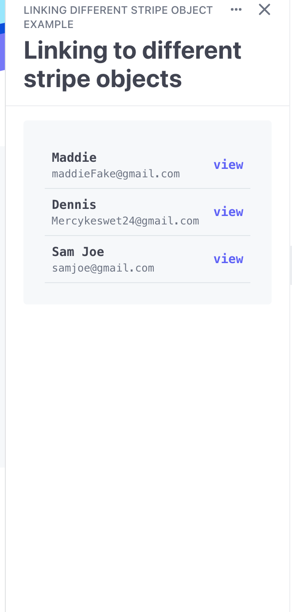
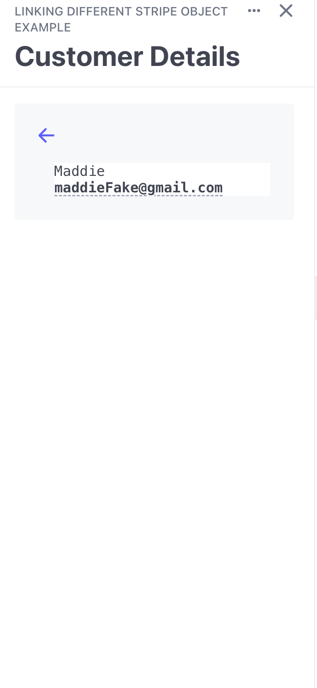

# Linking to Different Stripe Object Example




This is an example code that demonstrates how to construct a link with URL that leads to a different dashboard page. 

## Features Demonstrated
- How to construct a link with a URL that will lead a user to the dashboard page for a different Stripe object.
- Building the URL for both test and live environments.

## Running

1. From the `stripe-apps/examples/linking-different-stripe-object` directory, run `yarn` to install dependencies.
2. Once you install the `stripe apps` CLI plugin, run the start command:

```
 stripe apps start
```