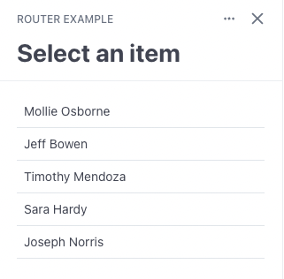
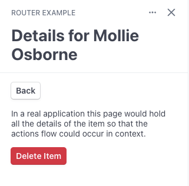

# Routing example

This example shows how you can use React Router within a Stripe App to control
complex multi-step flows that need to be history-aware (i.e. support a "Back"
button). Since sandboxed Apps don't have access to the browser history routing
won't be reflected in the page URL but most features of React Router still work
with an in-memory router implementation. This is conceptually similar to how
routing works in React Native apps.

## Running

1. Install dependencies by running `yarn`
2. Make sure you have [installed the Stripe Apps CLI plugin](https://stripe.com/docs/stripe-apps/getting-started#install)
3. Start the app preview by running `stripe apps start`