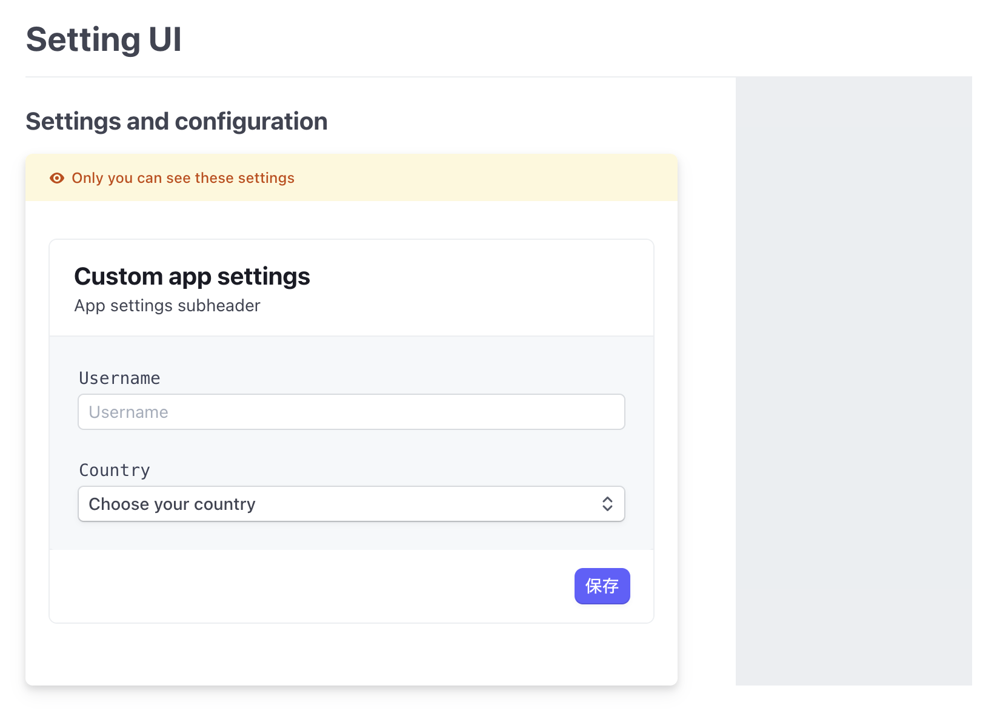
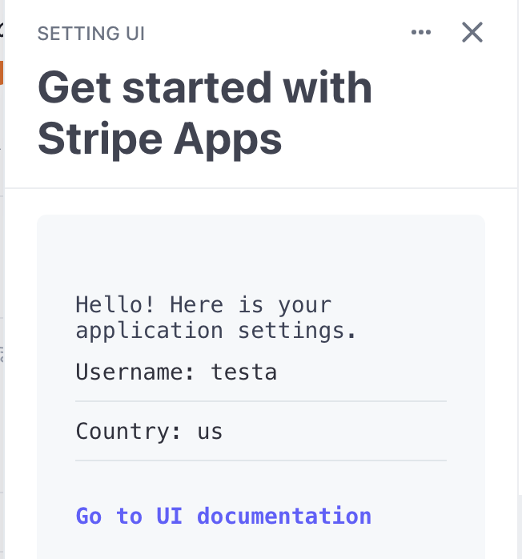

# [Demo] Setting UI and Storing data example





This is an example to save/update any application settings in the Stripe Dashboard.
And we can learn about how to use the secret API.

## Use case

- Save custom application settings
- Put any 3rd party API key
- etc..

## Running

1. From the `stripe-apps/examples/etting-ui` directory, run `yarn` to install dependencies
2. Once you install the `stripe apps` CLI plugin, run the start command:

```
stripe apps start
```

## Unit test

```bash
npm run test
```