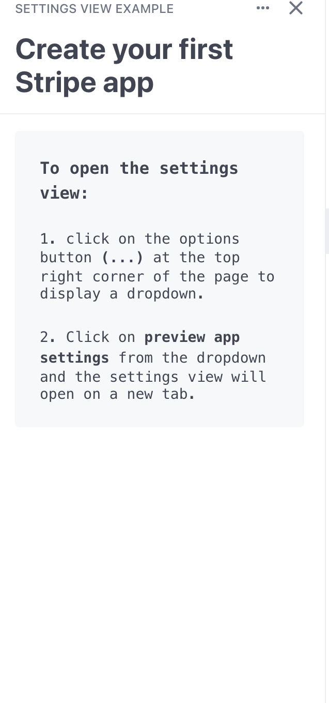
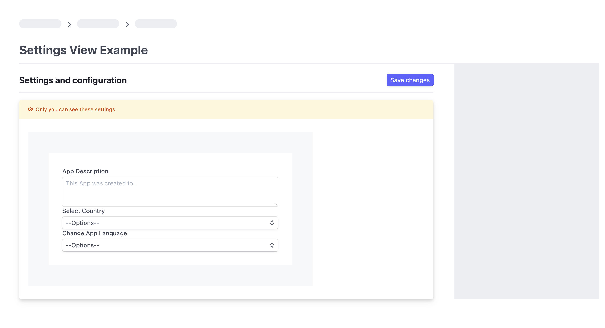

# Settings View Example




This is an example code that demonstrates how to display a settings page and using the SettingsView properties to save settings. The main purpose for this example is to show how to use the settingsView to allow admins configure their app installations.

## Setup

Make sure you are set up correctly by following the [UI Extension docs](https://stripe.com/docs/stripe-apps).

## Running

1. Rename the app ID in `frontend/stripe-app.json` to something unique.
2. Upload the example using `stripe apps upload`. This is necessary to get the APP_SECRET.
3. Copy the `.env.example` file into a file named `.env` in the folder of the server you want to use. For example:
```bash
cp .env.example backend/node/.env
``` 
4.  Set the following values:
   - APP_SECRET, get this from the uploaded app's details view
   - STRIPE_API_KEY, get this from your Stripe developer dashboard
4. `cd` to `frontend` folder and run `yarn` to install dependencies.
6. From the `backend` folder, pick the server language you want and follow the instructions in the server folder README on how to run.
7. Run the frontend with `stripe apps start`
