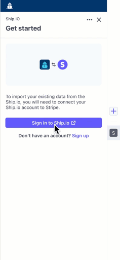

# Ship.IO Example



## Summary

This UI-only example demonstrates building a basic Stripe App using approved UI component patterns. It only contains enough logic to demonstrate basic UI functionality, making it easy to copy and use as a basis for a new Stripe App.

The app mocks an order fulfillment app that lets users create labels for shipments. It demonstrates how to build a views that follow [Stripe Apps design standards](https://stripe.com/docs/stripe-apps/patterns), including:

- Authentication [(LoginView)](src/views/LoginView.tsx)
- Sign out [(BaseView)](src/components/BaseView.tsx/)
- Navigation and routing [(App.tsx)](src/views/App.tsx)
- Backlinks ([HomeView](/src/views/HomeView.tsx), [ProductsView](src/views/ProductsView.tsx), [ShipmentView](src/views/ShipmentView.tsx))
- Action buttons ([ProductsView](src/views/ProductsView.tsx), [HomeView](src/views/HomeView.tsx))

## Running

You can run this app in preview mode to see it in action by using the following command.

```
stripe apps start
```
