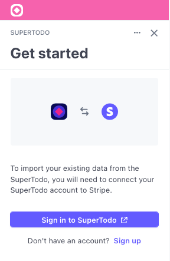
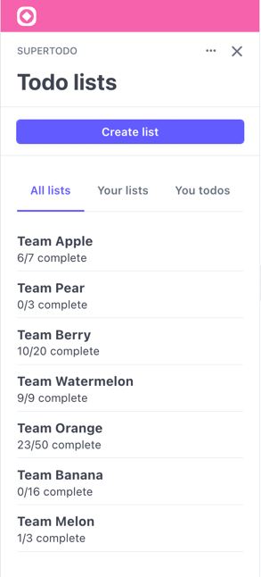
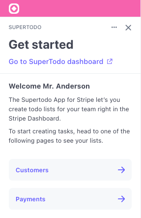
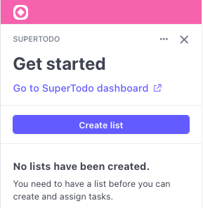

# SuperTodo Example

The following example demonstrates how to build certain UI. It does not contain
any logic, making it easy to copy and use the markup. 

## Views

### Customer detail view

Here we have a ready to use oAuth boilerplate. Getting the most out of the layout
system. One can simply drop in its own logo and set the endpoint to get started.



### Customer list view

Next to showcasing [context view](https://stripe.com/docs/stripe-apps/ui-toolkit/components/contextview)
`actions` and [tabs](https://stripe.com/docs/stripe-apps/ui-toolkit/components/tabs),
this view includes a more advanced flow utilizing the `FocusView`. 

By using a single `progress` variable, [stop using isLoading booleans](https://kentcdodds.com/blog/stop-using-isloading-booleans),
we track which state to render. It makes it possible to open the list creation
form; navigate to the next page; and render success or error states.

If a view has an abundant amount of UI elements and interactions going on,
consider breaking up the view in smaller components.



### Home overview view

A simple view, utilizing passed `userContext` to show a personalised welcome
message. Easily stitch together your views with `Link` components To improve
UX and guide your users through your app.



### Payment list view

This example view mocks a loading state for two seconds. Reacts `useEffect` 
makes it easy enough to await a real data loading situation, without needing
to change to UI code.

Use the `ContextViews` `actions` prop to highlight what can be done from this
view. The view will automatically create a dedicated section for your actions.



## Running

Although the app is not specifically made to run, one can preview it by running
the following command and see the app in action.

```
stripe apps start
```
