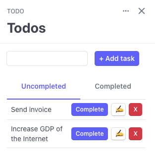

# Todo Example App



This is a simple Todo app built with Stripe App UI components and using Stripe Customer metadata to maintain state.

## Setup

Make sure you are set up correctly by following the [UI Extension docs](https://stripe.com/docs/stripe-apps).

## Running

1. From the `stripe-apps/examples/todo` directory, run `yarn` to install dependencies
2. Once you install the `stripe apps` CLI plugin, run the start command:

```
stripe apps start
```

Then in your Stripe dashboard, navigate to any Customer and open up the app drawer on the right. You'll then be able to add, remove and complete Todos that are saved uniquely to this customer.

## Testing

```
yarn run test
```

To run all the UI tests.
