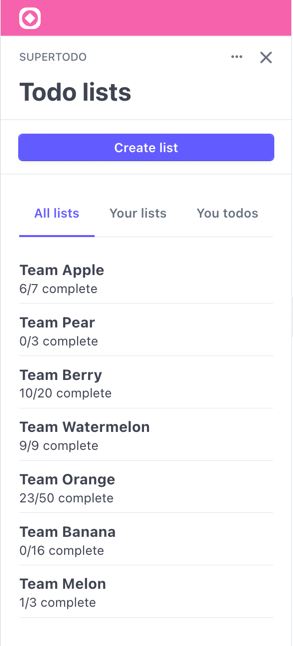

# SuperTodo Example

The following example demonstrates how to build certain UI. It does not contain
any logic, making it easy to copy and use the markup. 

## Views

### Payment list view

This view showcases [context view](https://stripe.com/docs/stripe-apps/ui-toolkit/components/contextview)
`actions` and [tabs](https://stripe.com/docs/stripe-apps/ui-toolkit/components/tabs).

[describe the focusview]



## Running

Although the app is not specifically made to run, one can preview it by running
the following command and see the app in action.

```
stripe apps start
```
