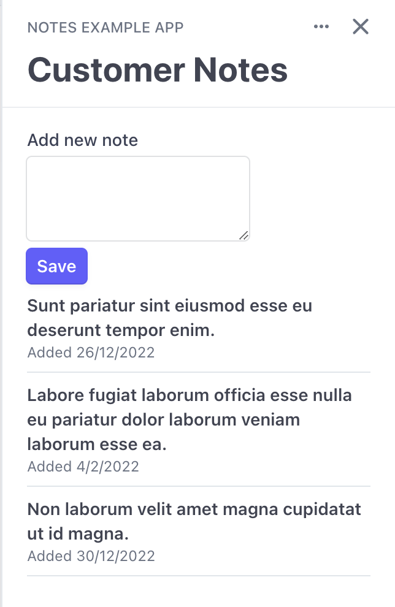

# Getting Started with Stripe App Development

The
[Stripe Apps documentation](https://stripe.com/docs/stripe-apps/getting-started)
provides all the core information you need to develop an app if you are already
familiar with the other technologies in use, such as React, NodeJS and Express.
If you're not as familiar with these technologies or if you want a more detailed
and gradual ramp up into App development, this guide will take you through the
process of developing a simple note-taking app comprising both a backend and a
frontend.

## Step 1: Creating and understanding your frontend

The Stripe CLI provides a convenient starting point for us with a simple app
template that we can generate by doing:

```sh
stripe-preview apps create notes-example-frontend
```

We are prompted to give our app a unique ID. Since IDs must be globally unique
it's good to use Java-style reverse-URI identifiers, such as
`com.example.notes`. We're also prompted for a display name to show wherever the
app is used, such as "Notes Example App". This will scaffold up an example
Stripe App, which has all the parts of a Typescript project with the addition of
a `stripe-app.json` configuration file and a sample `App.tsx` view.

### Stripe Apps are and are not React apps

If you look into that `App.tsx` file you will see a React component defined in
JSX syntax. If you're not familiar with React its
[new documentation](https://beta.reactjs.org/learn) provides a detailed
introduction but in short:

- **JSX** is a template by which a tree of elements is described in HTML-like
  syntax, with Javascript interpolations inside `{` curly brackets `}`
- Elements can either be HTML elements like `<div>` or custom **Components**
  which are defined as functions that return JSX
- Elements receive all attributes defined in JSX (such as `href="example.com"`)
  as **props**
- Components update when any state defined with `useState` or `useReducer` is
  changed, or when their parent component updates.
- Async workflows outside of the render cycle can be initiated through
  `useEffect`.

In most cases Stripe Apps behave like React apps and will feel familiar if
you've developed in React before. You can use all of the hooks you're used to,
state and rendering work exactly as they do in vanilla React and most libraries
that don't render something to the screen (state managers, data-fetching
libraries, etc.) should work as normal. However, there are some key differences:

- You cannot render regular HTML elements. Instead of HTML elements all trees
  must eventually emit UI toolkit components. This is similar to how React
  Native uses a custom set of base components like View, Text or Button.
- You cannot access the DOM and therefore cannot acquire
  [refs](https://reactjs.org/docs/refs-and-the-dom.html) of UI toolkit
  components.
- Instead of your app being a single component tree starting with a
  `React.render` call, your app is a series of isolated components which render
  only in a specific viewport. That is, an overlay over a specific Stripe
  Dashboard page. Which component renders in what viewport is configured in the
  `stripe-app.json` file, although it is common to use the CLI's "add" and
  "remove" methods instead of editing it directly.

## Step 2: Running the frontend

We can start the frontend by running

```sh
stripe-preview apps start
```

This will start a local development server on `http://localhost:4242` but we
don't actually access the app at that address because it has to run within the
context of a Stripe Dashboard. Instead, if we press "Enter" as prompted by the
CLI we'll be taken to a screen where we can select which Stripe account we want
to use to preview our app against and then taken to a Stripe Dashboard session
with our app running in preview mode.

Our only view, `App.tsx`, is associated with the
`stripe.dashboard.customer.detail` viewport by default. The preview flow should
have taken you to a customer detail view and opened the app in the sidebar but
if it hasn't, or if you ever navigate away from that page, just go back to view
a customer and click the little "N" square representing your app on the
right-hand-side menu.

Even though the Stripe Dashboard session is connecting to Stripe's servers, our
app preview is being served from our local machine, and will respond to any
changes we make. Change any little thing in `App.tsx` and see the UI
automatically change to match!

## Step 3: Building a user interface

The concept we want to build for our app is the capability to attach and view
notes on different customers. So in its most basic form our UI should consist of
a list of notes and a test input to add new ones. If we look through the
[UI toolkit catalogue](https://stripe.com/docs/stripe-apps/ui-toolkit/components)
we can see that TextArea, Button and List might be what we need.

Let's start with some static placeholder data to get the style right. The
following is a good first pass:

```tsx
const App = ({ userContext, environment }: TailorExtensionContextValue) => {
  return (
    <ContextView title="Customer Notes">
      <TextArea label="Add new note" />
      <Button type="primary">Save</Button>
      <List>
        <ListItem>
          <Box>Sunt pariatur sint eiusmod esse eu deserunt tempor enim.</Box>
          <Box slot="description">Added 27/12/2022</Box>
        </ListItem>
        <ListItem>
          <Box>
            Labore fugiat laborum officia esse nulla eu pariatur dolor laborum
            veniam laborum esse ea.
          </Box>
          <Box slot="description">Added 05/02/2022</Box>
        </ListItem>
        <ListItem>
          <Box>Non laborum velit amet magna cupidatat ut id magna.</Box>
          <Box slot="description">Added 31/12/2022</Box>
        </ListItem>
      </List>
    </ContextView>
  );
};
```

This should give us a UI like the following:



A quick step from here is to use JSX templating to iterate over the data as an
array. This will get us closer to what real functionality will look like:

```tsx
type Note = {
  text: string;
  dateAdded: Date;
};

const notes: Note[] = [
  {
    text: "Sunt pariatur sint eiusmod esse eu deserunt tempor enim.",
    dateAdded: new Date("2022-12-27"),
  },
  {
    text: "Labore fugiat laborum officia esse nulla eu pariatur dolor laborum veniam laborum esse ea.",
    dateAdded: new Date("2022-02-05"),
  },
  {
    text: "Non laborum velit amet magna cupidatat ut id magna.",
    dateAdded: new Date("2022-12-31"),
  },
];

const App = ({ userContext, environment }: TailorExtensionContextValue) => {
  return (
    <ContextView title="Customer Notes">
      <TextArea label="Add new note" />
      <Button type="primary">Save</Button>
      <List>
        {notes.map(({ text, dateAdded }, i) => (
          <ListItem key={i}>
            <Box>{text}</Box>
            <Box slot="description">Added {dateAdded.toLocaleDateString()}</Box>
          </ListItem>
        ))}
      </List>
    </ContextView>
  );
};
```

Templating like this uses standard Javascript methods like `Array.map` that
return other JSX templates. The only thing to keep in mind is that every
dynamically-generated element needs to be given a unique "key" via a prop like
you see above.

## Step 4: Using state and logic

We've now seen how to construct a user interface using React and the UI toolkit,
the only thing that is left from a frontend perspective is allowing the user to
change it by attaching handlers to the input that execute state changes. I won't
give you a full rundown of how state works in React but in short, `useState`
creates a variable that re-renders the component when its value is changed
through its setter. We can use this to enable adding notes by using the text
box:

```tsx
type Note = {
  text: string;
  dateAdded: Date;
};

const App = ({ userContext, environment }: TailorExtensionContextValue) => {
  const [notes, setNotes] = useState<Note[]>([]);
  const [textInput, setTextInput] = useState("");

  return (
    <ContextView title="Customer Notes">
      <TextArea
        label="Add new note"
        onChange={(e) => setTextInput(e.target.value)}
      />
      <Button
        type="primary"
        onPress={() =>
          setNotes((prevNotes) => [
            ...prevNotes,
            { text: textInput, dateAdded: new Date() },
          ])
        }
      >
        Save
      </Button>
      <List>
        {notes.map(({ text, dateAdded }, i) => (
          <ListItem key={i}>
            <Box>{text}</Box>
            <Box slot="description">Added {dateAdded.toLocaleDateString()}</Box>
          </ListItem>
        ))}
      </List>
    </ContextView>
  );
};
```

If you try typing in the box and pressing "Save" now you can see that new items
get added to the list. So we now have a basic working UI, even if it's not
pretty. However, because the list is currently just stored in the frontend it
will clear when the user navigates away or refreshes their browser. To persist
data and make this a potentially useful tool for collaboration we'll need a
backend with some form of data storage.

## Step 5: Creating a backend server

App frontends cannot store data locally themselves but they can make requests to
other APIs. In the future, Stripe will provide a simple DataStore API of their
own and even today you can store a limited amount of information in the metadata
of Stripe objects using the Stripe API. However, for full control and no
limitations you will have to build and host your own API.

There's nothing special about a Stripe Apps backend, it's just an HTTP server
that receives calls from the frontend. Therefore, you're free to develop your
backend in whatever language and framework you choose although it's better to
use one which has a
[Stripe official server-side library](https://stripe.com/docs/libraries#server-side-libraries)
available to avoid having to re-implement signature verification as we'll see
later. Because it is a simple and well-known server framework I'll give you all
the examples here in Express for NodeJS but the principles involved should be
simple to translate into whatever you need.

To create a backend server we're going to need a separate NPM project from our
frontend. So create another directory at the same level as
`notes-example-frontend` and name it `notes-example-backend`. Then, in a
terminal session navigate to that directory and run `yarn init -yp` to create a
basic `package.json` (if you don't have Yarn you can either install it or run
the equivalent NPM commands). Then we can install the dependencies we're going
to need:

```sh
yarn add express cors stripe
```

The first two we're going to need for our HTTP framework. The last one is
Stripe's server-side library which we're going to use to verify request
signatures.

You can now create an `index.js` file and add the basic boilerplate of an
Express app:

```js
const express = require("express");
const app = express();
const port = 3000;

app.listen(port, () => {
  console.log(`App listening on port ${port}`);
});
```

From now on you can run the backend server by entering `node .` in your
terminal. However, the server doesn't do anything yet.

## Step 6: Adding server-side functionality

To move the functionality we currently have on the client to be stored on the
server we need two things: a way to create notes and a way to retrieve all the
notes for a customer. For the purposes of this example we'll save the state in
memory but for a production app you should swap this out for a persistent data
store. Data store selection is a complex topic that depends on the environment
you're deploying in, your budget and your needs, so we can't get into it in this
guide. Let's start with the following:

```js
const dataStore = new Map();

function compositeId(customerId, accountId) {
  return `${customerId}.${accountId}`;
}

function getNotes(customerId, accountId) {
  const id = compositeId(customerId, accountId);
  return dataStore.get(id) ?? [];
}

function addNote(customerId, accountId, newNoteText) {
  const notes = getNotes(customerId, accountId);
  const id = compositeId(customerId, accountId);
  const newNote = {
    text: newNoteText,
    dateAdded: Date.now(),
  };
  const updatedNotes = [...notes, newNote];
  dataStore.set(id, updatedNotes);
  return updatedNotes;
}
```

We're making sure the store is keyed on the user's account as well as the
customer's ID to make sure a user can't access notes that don't belong to their
team. All users will share one server, so keeping data separated like this is
important. We'll go over how to make sure the accountId we're given is genuine
in a later step.

Now we just wire this up to HTTP handlers:

```js
app.get("/api/:accountId/notes/:customerId", (req, res) => {
  const notes = getNotes(req.params.accountId, req.params.customerId);
  res.json(notes);
});

app.post("/api/:accountId/notes/:customerId", express.text(), (req, res) => {
  const updatedNotes = addNote(
    req.params.accountId,
    req.params.customerId,
    req.body
  );
  res.json(updatedNotes);
});
```

If you now run the server again you should see you can save and retrieve notes.
Make some test requests to check it out:

```sh
curl --location --request POST 'localhost:3000/foo/notes/bar' \
--header 'Content-Type: text/plain' \
--data-raw 'Hello world!'
```

```sh
curl --location --request GET 'localhost:3000/foo/notes/bar'
```

## Step 7: Using signatures to verify users are who they say they are

Our API as it stands has a pretty glaring problem: anyone could input any
combination of accountId and customerId and access notes for an account they do
not own. We need to authenticate the user making the requests to verify they are
members of the account they're requesting to access or modify, as well as that
they're making the request from our app. Stripe App backends can achieve this
with
[request signatures](https://stripe.com/docs/stripe-apps/build-backend#authenticate-ui-to-backend),
where the app frontend attaches a signature to the request with which the
backend can verify certain data (usually the account and user ids of the caller)
was sent unmodified from a logged-in Stripe Dashboard.

Signature verification uses a secret specific to each app, which is generated on
Stripe's servers. To get access to it we need to upload our app to our Stripe
test account by going to the frontend folder again and executing the following
command:

```sh
stripe-preview apps upload
```

After the command has finished successfully, we can go to the "Developers"
section of the Stripe Dashboard and navigate to "My Apps", where we'll find our
test app. If we then click on our app to open its details we can reveal and copy
our signing secret, which should be a long string of random letters and numbers
prepended with `absec_`. This secret will work for this combination of app and
test account, regardless of whether you're using the uploaded version of the
frontend or running the preview version locally. If multiple developers are
collaborating on an app, add them all to the same Stripe test account so that
you can all share a single signing secret and therefore backend.

To authorize a request the backend needs three things:

1. The signing secret
2. The request signature
3. The signature payload, which consists of a userId and accountId by default

It's standard to send the signature as a `Stripe-Signature` header but it's
really up to you how the backend will receive the signature and payload. Since
our endpoints key on accountId but not userId, we will expect the userId as an
additional header on any route which has the "accountId" parameter to be able to
complete verification (for more details on param callbacks see
[the ExpressJS docs](https://expressjs.com/en/4x/api.html#app.param)):

```js
const stripe = require("stripe")(process.env.STRIPE_API_KEY);

app.param("accountId", (req, res, next, accountId) => {
  const sig = req.headers["stripe-signature"];
  const payload = JSON.stringify({
    user_id: req.headers["stripe-user-id"],
    account_id: accountId,
  });
  try {
    stripe.webhooks.signature.verifyHeader(
      payload,
      sig,
      process.env.STRIPE_APP_SECRET
    );
    next();
  } catch (err) {
    res.status(400).send(err.message);
  }
});
```

Now set both STRIPE_API_KEY to your developer API key and STRIPE_APP_SECRET to
the app secret you saved earlier before running the server again. If you try to
request anything from it now you should get back an error with the message
"Unable to extract timestamp and signatures from header" because the message is
not signed. From now on, only the app frontend will be able to make requests to
our backend. However, we have one more thing to do before that is possible.

## Step 8: CORS configuration

Because the app frontend runs sandboxed, all HTTP requests made from it will be
considered not only cross-origin but coming from a special, blank host. This
means that to be able to access backend responses in the browser, the backend
must respond with open CORS headers, allowing requests from any host.

In ExpressJS we will use the "cors" middleware for this but if you're using a
different setup, just configure CORS to return `Access-Control-Allow-Origin: *`
and all other required headers. Here's the ExpressJS code:

```js
app.use(require("cors")());
```

We are now ready to call our endpoints from the frontend.

## Step 9: Communication between frontend and backend

Making asynchronous HTTP requests in React can be tricky to get right and it's
often advisable to use a third-party library that solves most of the common
cases. For this example we'll use [SWR](https://swr.vercel.app/), a fairly
simple version of a data fetcher with a local cache. Let's install it in the
frontend folder:

```
yarn add swr
```

Next we'll use SWR to set up both the GET request to fetch data and the POST
request that will update it. The following is the working frontend code in its
entirety:

```tsx
import {
  Box,
  Button,
  ContextView,
  List,
  ListItem,
  TextArea,
} from "@stripe/ui-extension-sdk/ui";
import fetchStripeSignature from "@stripe/ui-extension-sdk/signature";
import type { TailorExtensionContextValue } from "@stripe/ui-extension-sdk/context";
import { useState } from "react";
import useSWR, { useSWRConfig } from "swr";

type Note = {
  text: string;
  dateAdded: number;
};

const apiBaseURL = "http://localhost:3000";

const App = ({ userContext, environment }: TailorExtensionContextValue) => {
  const userId = userContext!.id;
  const accountId = userContext!.account.id;
  const customerId = environment!.objectContext.id;
  const cacheId = [userId, accountId, customerId];
  const { data: notes = [], error } = useSWR(
    cacheId,
    async (userId, accountId, customerId) => {
      const response = await fetch(
        `${apiBaseURL}/api/${accountId}/notes/${customerId}`,
        {
          headers: {
            "Stripe-User-Id": userId,
            "Stripe-Signature": await fetchStripeSignature(),
          },
        }
      );
      return (await response.json()) as Note[];
    }
  );
  const { mutate } = useSWRConfig();
  const [textInput, setTextInput] = useState("");
  const postNote = async () => {
    const response = await fetch(
      `${apiBaseURL}/api/${accountId}/notes/${customerId}`,
      {
        method: "POST",
        body: textInput,
        headers: {
          "Content-Type": "text/plain",
          "Stripe-User-Id": userId,
          "Stripe-Signature": await fetchStripeSignature(),
        },
      }
    );
    return await response.json();
  };

  if (error)
    return (
      <ContextView title="Customer Notes">
        <Box>Something went wrong</Box>
      </ContextView>
    );

  return (
    <ContextView title="Customer Notes">
      <TextArea
        label="Add new note"
        onChange={(e) => setTextInput(e.target.value)}
      />
      <Button
        type="primary"
        onPress={() => {
          mutate(cacheId, postNote(), false);
        }}
      >
        Save
      </Button>
      <List>
        {notes.map(({ text, dateAdded }, i) => (
          <ListItem key={i}>
            <Box>{text}</Box>
            <Box slot="description">
              Added {new Date(dateAdded).toLocaleDateString()}
            </Box>
          </ListItem>
        ))}
      </List>
    </ContextView>
  );
};

export default App;
```

If you now run both the local backend and the local preview you'll be able to
see the app working end to end: new notes are saved persistently on the backend
so that if you refresh the page or close and open the app they will still be
there.

However, we can't publish our app having it call to localhost. Our backend needs
to be accessible from the Internet and registered as safe with Stripe.

## Step 10: Deployments and Content Security Policies

Deciding on a hosting provider and deployment strategy is beyond the scope of
this guide. Just like the issue of data storage, the correct decision for you
will depend on your budget, team and previous commitments. However, all hosting
strategies will have to deal with the same problem when it come to Stripe Apps:
your backend is now no longer allowed to be called by the app frontend, because
Stripe Apps run by default under a
[content security policy](https://developer.mozilla.org/en-US/docs/Web/HTTP/CSP)
that allows connections to localhost only.

To simulate this situation in our example we will forward our local server to
the public Internet with [ngrok](https://ngrok.com/). If you don't already have
ngrok installed, install it first and then run in a new terminal:

```sh
ngrok http 3000
```

This will give you a public URL that serves your local backend server. Take the
HTTPS URL, which will look something like `https://e78f-198-98-122-155.ngrok.io`
and set it as the `apiBaseUrl` in the frontend.

If you try to run the frontend now you will see an error message:

> Refused to connect to
> 'https://e78f-198-98-122-155.ngrok.io/api/\<account\>/notes/\<customer\>' because
> it violates the document's Content Security Policy.

Stripe is protecting users of your app by blocking the sending of Stripe data to
third-party services. You must instruct the app to request consent for making
these requests by giving the stripe apps CLI the base URL of your API (note that
it must contain a path and must end with a trailing slash) and the purpose for
which the app needs to make requests to it:

```sh
stripe-preview apps grant url "https://e78f-198-98-122-155.ngrok.io/api/" "Storing and retrieving notes"
```

If you now restart the frontend (you must restart the preview server and go back
through the preview onboarding by pressing "Enter" when prompted in the terminal
for CSP changes to be picked up) it should be working again. Now you know how to
connect a remote backend to a stripe app to give it persistence and additional
functionality and are ready to develop your own apps.
